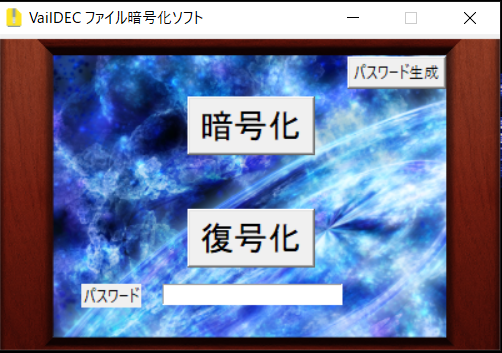

<h1>VailDEC3-sources</h1>

このソフトウェアは簡単に使用できることを目標に制作されたファイル暗号化ソフトウェアです。

<a href="https://github.com/Vail-Zero/VailDEC3-sources/releases/tag/1.0.0">Windowsインストーラ版</a>

下のホームページからでもダウンロードが可能です。 

<a href="http://gdec.starfree.jp/">http://gdec.starfree.jp/</a>

<h2>screenshot</h2>

本ソフトウェアでファイルに設定したパスワードを忘れた場合、作者でも解読は不可能です。
 
また本ソフトウェアで暗号化したファイルは同じVailDEC3でのみ復号化が可能です。

ソースコードは外部ライブラリ関係を除きすべてここにホストされています。
実行に必要なライブラリについてはsourcesディレクトリ内のReadMe.txtを参照

実行形式にする場合はライブラリのpyinstallerインストール後にcompile.batを実行

VailDEC3内で使っている別作者によるライブラリは、それぞれのライセンスに従ってください

VailDEC3はライブラリなどの環境を整えれば、どのプラットフォームでも動かすことができます。
LinuxとWindows10で確認済み
(画面の解像度によってレイアウトが崩れる場合があります。)